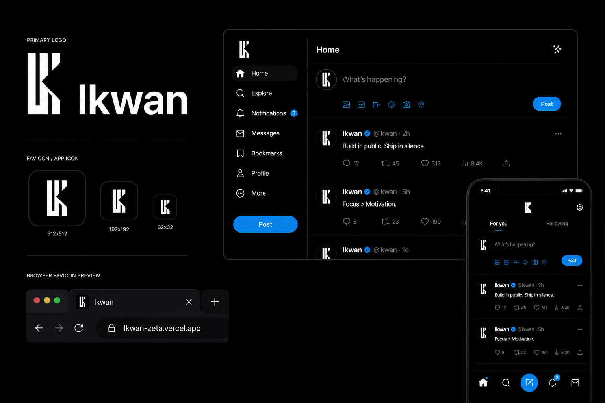

# Lkwan — Frontend UI

A modern, real-time social media frontend built with React.

## What is Lkwan?

Lkwan is a full-featured social media UI where users can share posts, follow people, send direct messages, and stay connected with real-time updates — all without page refreshes. This repository contains only the frontend source code.

## Lkwan Interface



## Key Features

- **Post Feed** — Share text and images. "For You" and "Following" feeds with infinite scroll.
- **Real-time Interactions** — Likes, comments, bookmarks, and follows update instantly via WebSocket.
- **Direct Messaging** — Private one-on-one chats with read receipts and image sharing.
- **Follow System** — Follow/unfollow users to curate your feed.
- **Verified Profiles** — Badge-based verification system.
- **Search** — Search posts by content, hashtags (`#tag`), and users (`@username`).
- **Media Upload** — Client-side image compression before upload.
- **Responsive Design** — Tailored layouts for mobile, tablet, and desktop.
- **Dark Theme** — Dark UI optimized for OLED screens.
- **PWA** — Installable on phone/desktop with offline support.

## Tech Stack

- **Framework:** React 18
- **Bundler:** Vite
- **Styling:** Tailwind CSS
- **Routing:** React Router v6
- **Icons:** Lucide React
- **Markdown:** react-markdown
- **Rich Text:** @dnd-kit (drag-and-drop), Emoji Mart (emoji picker)
- **PWA:** vite-plugin-pwa

## Getting Started

```bash
git clone <repo-url>
cd lkwan
npm install
npm run dev
```

The app requires a Supabase backend to function. Create a `src/supabaseClient.js` file with your project credentials:

```js
import { createClient } from '@supabase/supabase-js'

const supabaseUrl = import.meta.env.VITE_SUPABASE_URL
const supabaseKey = import.meta.env.VITE_SUPABASE_ANON_KEY

export const supabase = createClient(supabaseUrl, supabaseKey)
```

Then create a `.env` file:

```
VITE_SUPABASE_URL=https://your-project.supabase.co
VITE_SUPABASE_ANON_KEY=your-anon-key
VITE_VAPID_PUBLIC_KEY=your-vapid-public-key
```

### Build for production

```bash
npm run build
npm run preview
```
